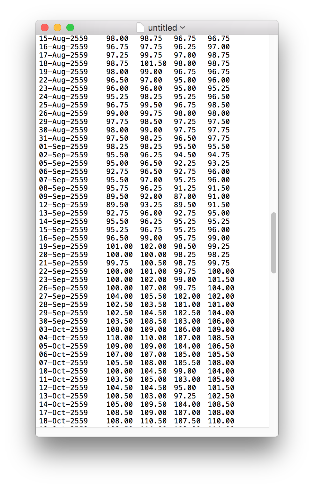

<h1>SET API</h1>
<h3 id="header-3">getstock</h3>

<pre class="highlight"><code>// Javascript code with syntax highlighting.
[data set] = getstock([symbol],[date period]);
   [symbol] : stock symbol เช่น aot,advanc 
   [date period] : จำนวนระยะเวลาย้อนหลัง เช่น -30 คือย้อนหลังจากวันปัจจุบัน 30 วัน
   [data set] : return open,high,low,close,vol 
</code></pre>

<h3 id="header-3">connect2setapi</h3>

<pre class="highlight"><code>// Javascript code with syntax highlighting.
[connection] = connect2setapi([servername],[username],[password]);
   [connection] : connection สำหรับเชื่อมต่อในการเชื่อมต่ออีกครั้ง 
   [servername] : IP Address สำหรับใช้งาน
   [username] : username สำหรับเข้าใช้งานระบบ เช่น adam
   [password] : password สำหรับเข้าใช้งานระบบ เช่น smith
</code></pre>

